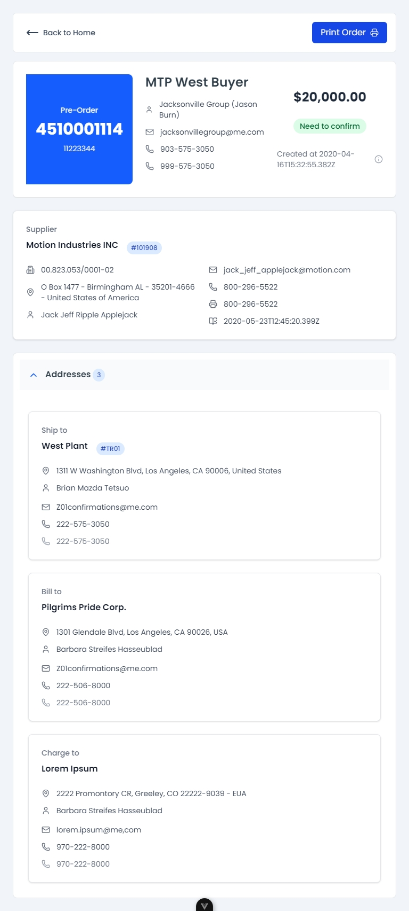

# 🛒 ME Challenge - Desafio Frontend Vue.js 3

> **Desafio técnico para vaga de desenvolvedor frontend senior**  
> Uma aplicação em VueJs com router, na qual é possivel visualizar pedidos fazendo uma busca na API disponibilizada.

## 🎯 Sobre o Projeto

Este projeto é um challenge técnico focado em demonstrar habilidades em **Vue.js 3**, **TypeScript** e **arquitetura escalável**. A aplicação simula uma página de detalhes de pedido, implementando:

> 🌐 **Demo em Produção:** [Acesse a aplicação](https://wondrous-arithmetic-04668b.netlify.app/order/1)

- ✅ **Arquitetura limpa** com separação de responsabilidades
- ✅ **Padrões SOLID** e princípios de clean code
- ✅ **Repository Pattern** para abstração de dados
- ✅ **Composition API** do Vue 3
- ✅ **TypeScript** para tipagem estática
- ✅ **Testes unitários** e **E2E** com Cypress

## 🚀 Stack Tecnológica

### Core

- **Vue.js 3** - Framework principal com Composition API
- **TypeScript** - Tipagem estática para melhor qualidade de código
- **Vite** - Build tool rápido e moderno

### Estilização

- **Tailwind CSS** - Framework CSS utilitário
- **CSS Modules** - Para estilos componentizados
- **PostCSS** - Processamento de CSS

### Qualidade e Testes

- **ESLint** - Linting de código
- **Vitest** - Framework de testes unitários
- **Vue Test Utils** - Utilitários para testes Vue
- **Cypress** - Testes end-to-end

## 📁 Estrutura do Projeto

```
src/
├── assets/           # Recursos estáticos e estilos
├── components/       # Componentes reutilizáveis
│   ├── ui/          # Componentes de UI básicos
│   └── business/    # Componentes específicos do negócio
├── composables/     # Composables Vue 3
├── core/            # Configurações HTTP e tipos
├── features/        # Funcionalidades organizadas por domínio
├── router/          # Configuração de rotas
├── utils/           # Utilitários e helpers
└── views/           # Páginas/rotas da aplicação
```

## 🛠️ Pré-requisitos

- **Node.js** 20+
- **npm** 8+ ou **yarn** 1.22+
- **Git**

## ⚡ Instalação e Configuração

### 1. Clone o repositório

```bash
git clone https://github.com/juniorpaiva95/me-challenge
cd me-challenge
```

### 2. Instale as dependências

```bash
npm install
```

### 3. Configure as variáveis de ambiente

```bash
# Copie o arquivo de exemplo
cp env.production.example .env.local

# Edite o arquivo .env.local com suas configurações
VITE_API_BASE_URL=https://api.mercadoe.space
```

## 🚀 Como Executar

### Desenvolvimento Local

```bash
# Inicia o servidor de desenvolvimento com hot-reload
npm run dev

# Acesse: http://localhost:5173
```

## 🧪 Testes

### Testes Unitários com Vitest

```bash
# Executa todos os testes unitários
npm run test:unit

# Executa testes em modo watch (desenvolvimento)
npm run test:unit:watch

# Executa testes com cobertura
npm run test:unit:coverage
```

**Cobertura de Testes:**

- Foi aplicado testes em alguns componentes, App.spec.ts, Collapse.spec.ts

### Testes End-to-End com Cypress

#### Desenvolvimento (mais rápido)

```bash
# Inicia o servidor de desenvolvimento e executa testes E2E
npm run test:e2e:dev
```

#### Interface do Cypress

```bash
# Abre a interface gráfica do Cypress
npm run cypress:open
```

**Estrutura dos Testes E2E:**

```
cypress/
├── e2e/              # Testes end-to-end
│   └── home-page.cy.ts
├── fixtures/         # Dados de teste
├── support/          # Comandos e configurações
└── downloads/        # Downloads dos testes
```

## 🏗️ Arquitetura e Padrões

### Repository Pattern

```typescript
// Abstração para acesso a dados
interface OrderRepository {
  getOrderById(id: string): Promise<Order>
  getOrders(params?: OrderQueryParams): Promise<Order[]>
}

// Implementação concreta
export class ApiOrderRepository extends BaseRepository implements OrderRepository {
  constructor(httpClient: HttpClient) {
    super(httpClient)
    this.basePath = '/api/orders'
  }

  async getOrderById(id: string): Promise<Order> {
    const response = await this.httpClient.get<Order>(id)
    return response.data
  }
}
```

### HTTP Client Abstrato

```typescript
interface HttpClient {
  get<T>(url: string, config?: RequestConfig): Promise<ApiResponse<T>>
  post<T>(url: string, data?: any, config?: RequestConfig): Promise<ApiResponse<T>>
  // ... outros métodos
}
```

## 🎨 Design System

### Variáveis CSS e Tokens

```css
:root {
  --color-primary: #007bff;
  --color-secondary: #6c757d;
  --color-success: #28a745;
  --color-danger: #dc3545;

  --font-family-base: 'Inter', -apple-system, BlinkMacSystemFont, sans-serif;
  --spacing-xs: 0.25rem;
  --spacing-sm: 0.5rem;
  --spacing-md: 1rem;
}
```

### Componentes de UI

- **BaseButton** - Botões com variantes e estados
- **AlertMessage** - Mensagens de alerta e erro
- **Badge** - Badges para status e categorias
- **Skeleton** - Placeholders de carregamento

## 📱 Responsividade

O projeto foi desenvolvido com foco em **mobile-first** e inclui screenshots de diferentes dispositivos para validação da responsividade:

### 📱 Dispositivos Móveis

| Dispositivo           | Descrição                    | Screenshot                                                                                                   |
| --------------------- | ---------------------------- | ------------------------------------------------------------------------------------------------------------ |
| **iPhone 12 Pro**     | Dispositivos móveis pequenos |            |
| **iPhone 14 Pro Max** | Dispositivos móveis grandes  |  |

### 📱 Tablets

| Dispositivo  | Descrição         | Screenshot                                                                             |
| ------------ | ----------------- | -------------------------------------------------------------------------------------- |
| **iPad Air** | Tablets compactos |  |
| **iPad**     | Tablets padrão    |            |

### 💻 Desktop

| Dispositivo     | Descrição          | Screenshot                                                                                   |
| --------------- | ------------------ | -------------------------------------------------------------------------------------------- |
| **MacBook Pro** | Desktops e laptops |  |

> 💡 **Nota:** Todas as imagens estão disponíveis em `src/assets/images/` para verificação da adaptação responsiva da interface.

## 📝 Padrões de Commit seguindo SEMVER (Semantic Version)

```bash
feat: adiciona componente OrderDetails
fix: corrige validação de formulário
docs: atualiza documentação da API
style: ajusta espaçamentos do layout
refactor: refatora lógica de busca de pedidos
test: adiciona testes para useOrder
chore: atualiza dependências
```

## 🚀 Deploy

### Netlify Functions

O projeto inclui configuração para Netlify Functions para proxy de API:

```javascript
// netlify/functions/api-proxy.js
exports.handler = async (event, context) => {
  // Proxy para APIs externas
}
```

### Configuração Netlify

```toml
# netlify.toml
[build]
  publish = "dist"
  functions = "netlify/functions"

[[redirects]]
  from = "/api/*"
  to = "/.netlify/functions/api-proxy"
  status = 200
```

## 📚 Recursos e Referências

- [Vue.js 3 Guide](https://vuejs.org/guide/)
- [Composition API](https://vuejs.org/guide/extras/composition-api-faq.html)
- [TypeScript Support](https://vuejs.org/guide/typescript/overview.html)
- [Vite](https://vitejs.dev/) - Build tool
- [Vitest](https://vitest.dev/) - Testing framework
- [Cypress](https://www.cypress.io/) - E2E testing
